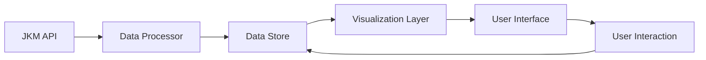

# Malaysia Flood Evacuation Centers Dashboard: Concept Document

## 🎯 Vision

To create an accessible, real-time visualization platform that helps stakeholders understand and respond to flood situations in Malaysia by providing clear, actionable insights about evacuation centers and affected populations.

## 🎨 Design Philosophy

### Core Principles

1. **Clarity First**
   - Prioritize clear presentation of critical information
   - Use visual hierarchy to guide attention to key metrics
   - Minimize cognitive load through thoughtful data organization

2. **Accessibility**
   - Ensure readability across different devices and screen sizes
   - Support multiple languages (future enhancement)
   - Consider color-blind friendly design choices

3. **Real-time Focus**
   - Emphasize current situation awareness
   - Provide historical context when relevant
   - Enable quick identification of trends and patterns

## 👥 User Personas

### 1. Emergency Responders
- **Needs**: Quick access to center locations and capacities
- **Pain Points**: Limited time for data interpretation
- **Solutions**: 
  - Clear status indicators
  - Quick-view summary statistics
  - Mobile-optimized interface

### 2. Public Officials
- **Needs**: Overview of affected areas and resource allocation
- **Pain Points**: Requires both detailed and summary views
- **Solutions**:
  - District-level aggregation
  - Exportable reports
  - Trend analysis

### 3. General Public
- **Needs**: Information about nearby evacuation centers
- **Pain Points**: Understanding technical information
- **Solutions**:
  - Simple, intuitive interface
  - Clear explanations of terms
  - Location-based filtering

## 🔄 Data Flow

## 📊 Visualization Strategy

### Current Implementation
1. **Summary Cards**
   - Total evacuation centers
   - Total evacuees
   - Active districts

2. **Bar Chart**
   - District-wise distribution
   - Interactive tooltips
   - Responsive scaling

3. **Detailed Table**
   - Comprehensive center information
   - Sortable columns
   - Search functionality

4. **Geographic Map**
   - Center locations with interactive popups
   - District boundaries for Peninsula and Borneo
   - Visual indicators for center capacity
   - Statistics overlay

### Future Enhancements
1. **Advanced Geographic Features**
   - Heat maps of affected areas
   - Terrain analysis
   - Flood zone overlays

2. **Time Series Visualization**
   - Evacuation trends
   - Historical patterns
   - Predictive analytics

3. **Resource Distribution**
   - Supply levels
   - Staff allocation
   - Capacity utilization

## 🔍 Data Analysis Features

### Current
- Basic statistical summaries
- District-level aggregation
- Real-time updates

### Planned
1. **Predictive Analytics**
   - Capacity forecasting
   - Resource requirement predictions
   - Trend analysis

2. **Advanced Filtering**
   - Multi-parameter search
   - Custom date ranges
   - Geographic filtering

3. **Comparative Analysis**
   - Year-over-year comparisons
   - District benchmarking
   - Resource efficiency metrics

## 🛠️ Technical Architecture

### Frontend
- **Current**
  - D3.js for visualizations
  - Vanilla JavaScript for interactions
  - Responsive CSS

- **Future**
  - Framework migration (React/Vue/Svelte)
  - PWA capabilities
  - Offline support

### Backend (Future)
- Data caching layer
- Authentication system
- API rate limiting
- Historical data storage

## 📱 Mobile Considerations

1. **Responsive Design**
   - Fluid layouts
   - Touch-friendly interfaces
   - Optimized data loading

2. **Progressive Enhancement**
   - Core functionality without JavaScript
   - Graceful degradation
   - Bandwidth-conscious loading

## 🔒 Security & Privacy

1. **Data Protection**
   - Personal information handling
   - Data retention policies
   - Access control levels

2. **API Security**
   - Rate limiting
   - CORS policies
   - Error handling

## 📈 Success Metrics

1. **User Engagement**
   - Session duration
   - Interaction rate
   - Return visits

2. **Performance**
   - Load time
   - Update frequency
   - Error rates

3. **Impact**
   - Information accuracy
   - Response time improvement
   - User satisfaction

## 🗓️ Development Roadmap

### Phase 1 (Current)
- Basic dashboard implementation
- Real-time data integration
- Essential visualizations

### Phase 2 (Short-term)
- Geographic visualization
- Advanced filtering
- Mobile optimization
- Multi-language support

### Phase 3 (Long-term)
- Predictive analytics
- Offline capabilities
- API enhancement
- Historical data analysis

## 🤝 Community Engagement

1. **Open Source Collaboration**
   - Code contribution guidelines
   - Documentation standards
   - Issue tracking

2. **User Feedback**
   - Feature requests
   - Bug reports
   - Usage analytics

3. **Stakeholder Involvement**
   - Regular consultations
   - User testing
   - Feature prioritization

## 📚 References

1. JKM API Documentation
2. Malaysia Flood Management Guidelines
3. International Disaster Response Standards
4. Data Visualization Best Practices
